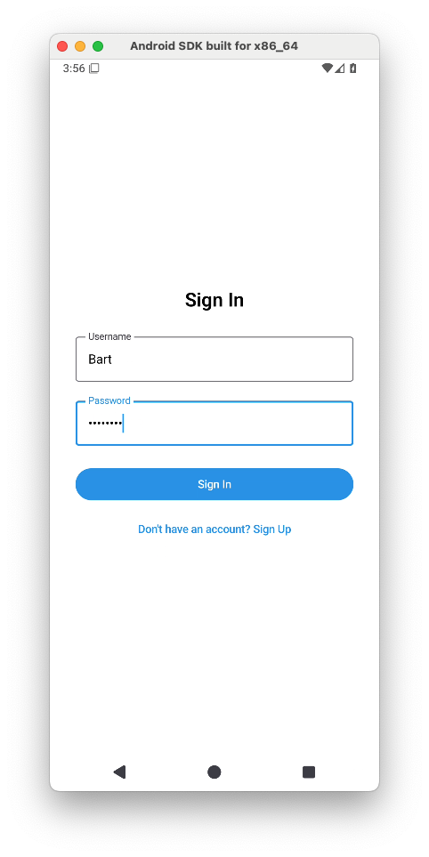
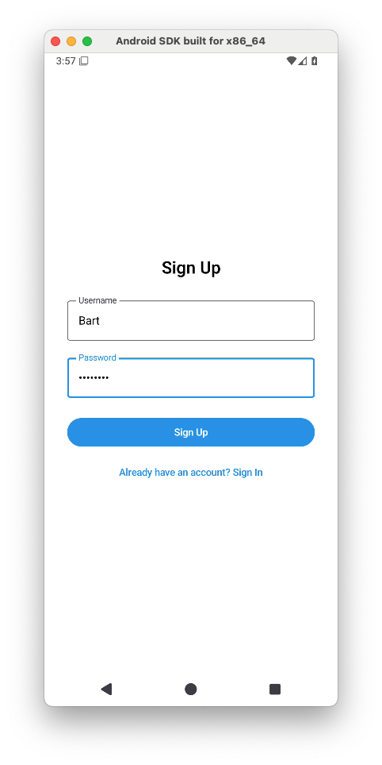
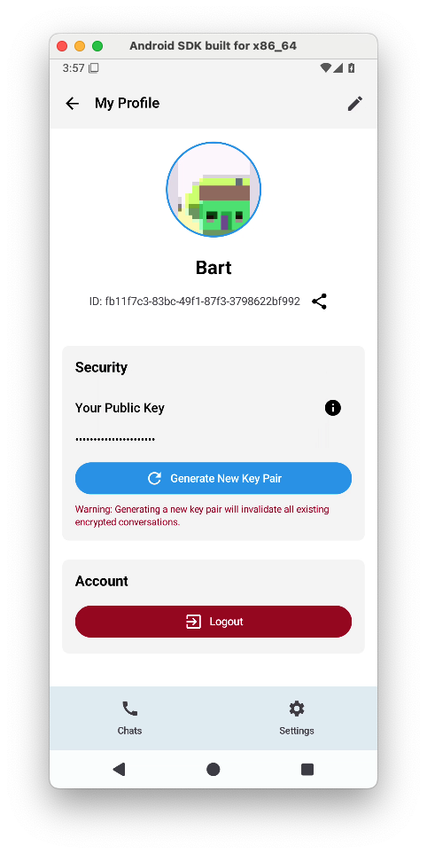
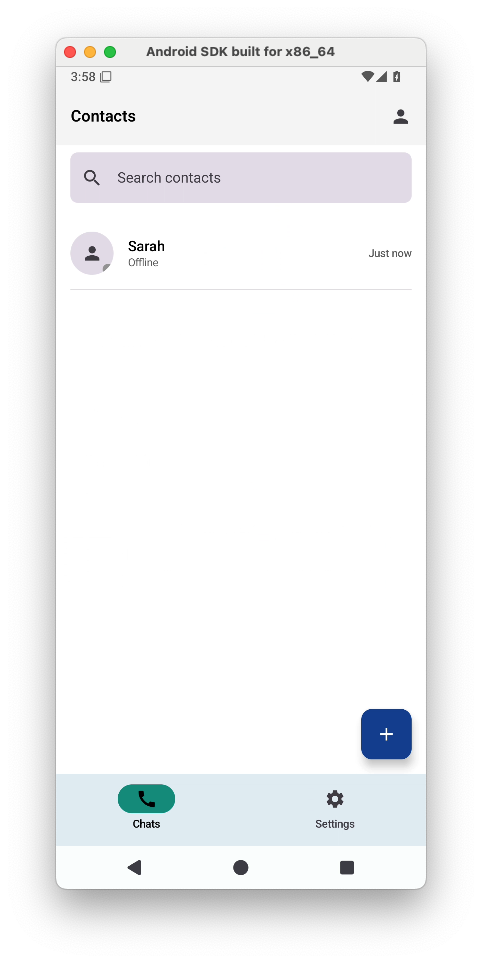
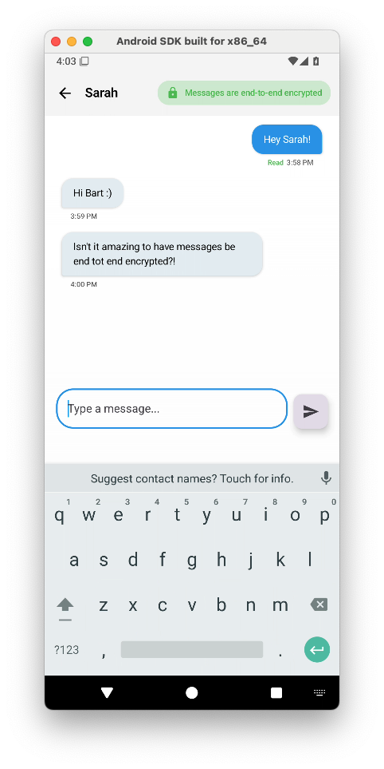
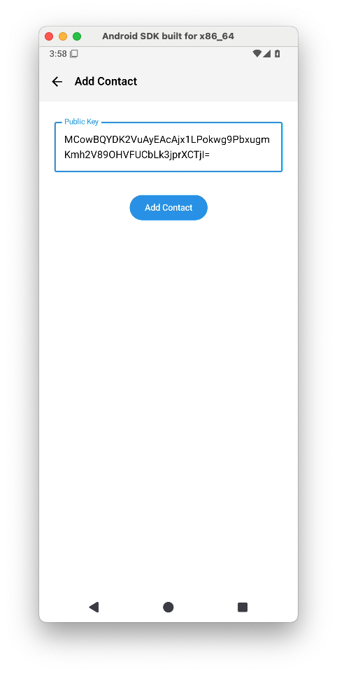
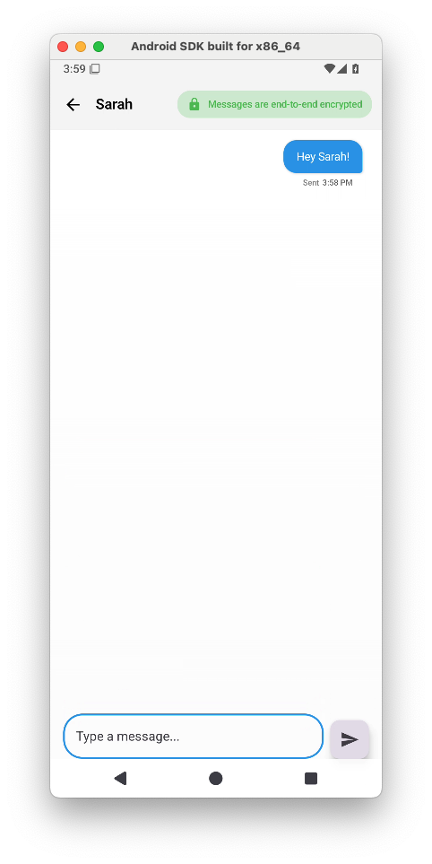
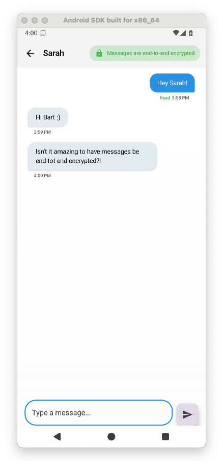

# 📡 SafeChat - End-to-End Encrypted Messaging App

**SafeChat** is a proof-of-concept end-to-end encrypted (E2EE) messaging application, demonstrating secure communication principles using an Android frontend (Kotlin) and a Rust backend (Axum framework with PostgreSQL).

---

## ⚠️ Disclaimer

> **This is not production-ready software.**
>
> SafeChat is intended strictly for **educational and demonstration purposes only**. It may contain implementation flaws, unpatched vulnerabilities, or insecure design choices. **Do not use this application for real-world communication or to transmit sensitive information.**

---

## 📑 Table of Contents

- [Overview](#overview)
- [Features](#features)
- [Architecture](#architecture)
- [Security Details](#security-details)
- [App Screenshots](#app-screenshots)
- [Message Flow (Mermaid Chart)](#message-flow-mermaid-chart)
- [License](#license)

---

## 🧭 Overview

SafeChat illustrates the fundamentals of secure messaging with:

- **Frontend:** Android app written in Kotlin, using Room for local storage and Jetpack Compose UI.
- **Backend:** Rust server using Axum framework with PostgreSQL database.
- **Encryption:** X25519 for key exchange, AES-GCM for message encryption (client-side).
- **Authentication:** JWT tokens with Argon2 password hashing.
- **Key Storage:** Android Keystore for local private key security.
- **Real-time Communication:** WebSocket connections for instant messaging and status updates.

---

## ✨ Features

- Secure user registration and login with Argon2 password hashing.
- Public key-based contact management.
- Client-side end-to-end encryption and decryption.
- Local encrypted message storage using Room.
- Message status updates (SENDING → SENT → READ) with real-time synchronization.
- Bidirectional status notifications - both sender and receiver always know the current message status.
- Privacy protection - server auto-deletes messages 5 seconds after they are marked as read.
- WebSocket-based real-time communication for instant message delivery and status updates.

---

## 🏗 Architecture

**Complete message flow:**

1. **Registration:** Users register with Argon2-hashed passwords and generate X25519 key pairs.
2. **Contact Discovery:** Contacts are added via public key exchange (no user enumeration).
3. **Message Creation:** Messages are encrypted client-side using AES-GCM with shared secrets.
4. **Real-time Delivery:** WebSocket connections enable instant message delivery and status updates.
5. **Status Synchronization:** Message status progresses through SENDING → SENT → READ with bidirectional updates.
6. **Privacy Protection:** Read messages are automatically deleted from server after 5 seconds.
7. **Local Storage:** All messages are stored locally in encrypted Room database for offline access.

---

## 🔐 Security Details

- **Key Exchange:** X25519 (Elliptic-curve Diffie-Hellman) with X.509 encoding
- **Message Encryption:** AES-GCM (client-side, with IV and authentication tag)
- **Password Hashing:** Argon2 with secure parameters
- **Key Storage:** Android Keystore (for private keys and JWTs)
- **Communication:** WebSocket for real-time messaging and status updates
- **Message Lifecycle:** Messages auto-deleted from server 5 seconds after READ status
- **Database:** PostgreSQL for server storage, Room (SQLite) for local Android storage

---

## 📸 App Screenshots

### Authentication Flow
| Login Screen | Registration Screen | Profile Setup |
|:---:|:---:|:---:|
|  |  |  |

### Main Interface
| Contact List | Chat Interface | Add Contact |
|:---:|:---:|:---:|
|  |  |  |

### Message Status Flow
| Sent | Read |
|:---:|:---:|
 |  |

---

## 🧬 Message Flow (Mermaid Chart)

The diagram below visualizes registration, authentication, contact management, and E2EE message flow.

```mermaid
sequenceDiagram
    participant U as User
    participant App as SafeChatApp
    participant KS as Keystore
    participant DB as RoomDB
    participant WS as WebSocket
    participant BE as Backend
    participant PG as PostgreSQL
    Note over U,PG: Registration with X25519 Key Generation
    U->>App: Enter username/password, tap Register
    App->>KS: Generate X25519 keypair
    App->>App: Encode public key (X.509)
    App->>BE: POST /auth/register
    BE->>BE: Hash password (Argon2)
    BE->>BE: Generate server X25519 keypair
    BE->>PG: INSERT user data
    BE-->>App: Return {id, public_key, JWT}
    App->>KS: Store JWT securely
    App->>BE: PUT /profile/key
    BE->>BE: Validate X.509 format
    BE->>PG: UPDATE user public_key
    BE-->>App: 200 OK
    App->>DB: Store profile locally
    App-->>U: "Registration successful"
    Note over U,PG: Authentication & Real-time Setup
    U->>App: Enter credentials, tap Login
    App->>BE: POST /auth/login
    BE->>PG: SELECT user
    BE->>BE: Verify password (Argon2)
    alt Valid credentials
        BE-->>App: Return JWT
        App->>KS: Store JWT
        App->>BE: GET /profile (Bearer token)
        BE->>BE: Validate JWT
        BE->>PG: SELECT profile
        BE-->>App: Return profile + public_key
        App->>DB: Store profile
        App->>WS: Connect /ws?token=JWT
        BE->>BE: Validate JWT
        BE-->>WS: Connection established
        WS-->>App: Connected
        App->>DB: Load contacts & messages
        App-->>U: Show chat interface
    else Invalid
        BE-->>App: 401 Unauthorized
        App-->>U: Error message
    end
    Note over U,PG: Contact Discovery
    U->>App: Enter contact's public key
    App->>BE: GET /user/{public_key}
    BE->>BE: Validate JWT
    BE->>PG: SELECT user by public_key
    alt Found
        BE-->>App: Return contact info
        App->>App: Compute shared secret (ECDH)
        App->>KS: Store shared secret
        App->>DB: INSERT contact
        App-->>U: "Contact added"
    else Not found
        BE-->>App: 404 Not Found
        App-->>U: "Contact not found"
    end
    Note over U,PG: E2E Encrypted Messaging
    U->>App: Type message, tap Send
    App->>App: Generate UUID & 12-byte IV
    App->>KS: Get shared secret
    App->>App: Encrypt (AES-GCM-256)
    Note over App: Creates encrypted_content + auth_tag
    App->>DB: Store locally (status=SENDING)
    App-->>U: Show "Sending..." status
    App->>WS: Send encrypted message
    WS->>BE: Forward message
    BE->>BE: Generate timestamp
    BE->>BE: Validate receiver_id
    BE->>PG: INSERT message (encrypted only)
    Note over BE: Server never sees plaintext
    BE->>WS: Broadcast to sender (status: SENT)
    WS-->>App: Status update
    App->>DB: UPDATE status=SENT
    App-->>U: Show "Sent ✓"
    BE->>WS: Broadcast to receiver
    Note over BE: Real-time if online, queued if offline
    Note over U,PG: Instant Delivery & Decryption
    WS-->>App: New message notification
    App->>App: Decode base64 content & IV
    App->>KS: Get shared secret
    App->>App: Decrypt (AES-GCM-256)
    App->>App: Verify auth tag
    Note over App: Ensures integrity
    App->>DB: Store message
    App-->>U: Display decrypted message
    Note over App: All crypto client-side
    Note over U,PG: Status Updates & Privacy
    U->>App: View message thread
    App->>WS: Send read status
    WS->>BE: Forward status
    BE->>BE: Validate ownership
    BE->>PG: UPDATE status='read'
    BE->>WS: Broadcast to both parties
    WS-->>App: Status update
    App->>DB: UPDATE status='read'
    App-->>U: Show "Read ✓✓"
    BE->>BE: Schedule 5s deletion task
    Note over BE: Tokio spawn background task
    BE->>BE: Sleep 5 seconds
    BE->>PG: DELETE message
    Note over BE: Forward secrecy protection
    Note over U,PG: WebSocket Reliability
    alt Connection lost
        WS-->>App: Connection lost
        App-->>U: Show "Connecting..."
        App->>App: Start backoff (1s, 2s, 4s, 8s, max 30s)
        loop Reconnection
            App->>KS: Get JWT
            App->>WS: Reconnect /ws?token=JWT
            BE->>BE: Validate JWT
            alt JWT valid
                WS-->>App: Connected
                App-->>U: Show "Connected"
                App->>BE: GET /messages to sync
                BE->>BE: Auth with Bearer token
                BE->>PG: SELECT recent messages
                BE-->>App: Return encrypted history
                App->>App: Process messages
                App->>DB: Merge (avoid duplicates)
                App-->>U: Update chat interface
                App->>App: Reset backoff
            else JWT expired
                App->>App: Clear credentials
                App-->>U: Redirect to login
            else Network unavailable
                App->>App: Increase backoff
                App-->>U: Show retry countdown
            end
        end
    end
    Note over U,PG: Secure Message Sync
    App->>BE: GET /messages/{contact_id}
    BE->>BE: Validate JWT & extract claims
    BE->>BE: Verify access permissions
    BE->>PG: SELECT messages (LIMIT 50)
    BE-->>App: Return encrypted array
    loop Each message
        App->>App: Validate structure
        App->>KS: Get shared secret
        App->>App: Attempt AES-GCM decryption
        alt Success
            App->>App: Verify auth tag
            App->>DB: INSERT OR REPLACE
            App-->>U: Update chat
        else Failed
            App->>App: Log error
            App-->>U: Show decrypt error
            Note over App: Handles key rotation
        end
    end
    Note over App: RoomDB is single source of truth
    Note over App: WebSocket updates DB, UI reacts via Flow

```

Click to expand

---

## 📄 License

This project is released under the MIT License.
