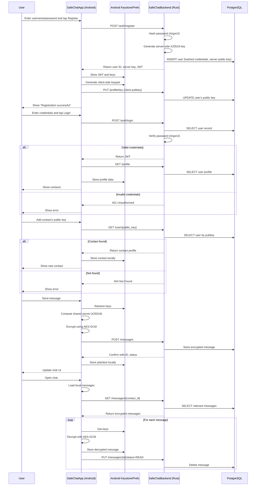

# 📡 SafeChat - End-to-End Encrypted Messaging App

**SafeChat** is a proof-of-concept end-to-end encrypted (E2EE) messaging application, demonstrating secure communication principles using an Android frontend (Kotlin) and a Rust backend.

---

## ⚠️ Disclaimer

> **This is not production-ready software.**
>
> SafeChat is intended strictly for **educational and demonstration purposes only**. It may contain implementation flaws, unpatched vulnerabilities, or insecure design choices. **Do not use this application for real-world communication or to transmit sensitive information.**

---

## 📑 Table of Contents

* [Overview](#overview)
* [Features](#features)
* [Architecture](#architecture)
* [Security Details](#security-details)
* [Message Flow (Mermaid Chart)](#message-flow-mermaid-chart)
* [License](#license)

---

## 🧭 Overview

SafeChat illustrates the fundamentals of secure messaging with:

* **Frontend:** Android app written in Kotlin, using Room for local storage.
* **Backend:** Rust server using PostgreSQL.
* **Encryption:** X25519 for key exchange, AES-GCM for message encryption.
* **Authentication:** JWT tokens.
* **Key Storage:** Android Keystore for local private key security.

---

## ✨ Features

* Secure user registration and login with Argon2 password hashing.
* Public key-based contact management.
* Client-side end-to-end encryption and decryption.
* Local encrypted message storage using Room.
* Message status updates (sent/read).
* Server auto-deletes messages after they are marked as read.

---

## 🏗 Architecture

**Typical flow:**

1. Users register and generate X25519 key pairs.
2. Contacts are added via public key exchange.
3. Messages are encrypted on the sender’s device using the shared secret.
4. Recipients decrypt messages locally after retrieving them from the server.
5. Read messages are marked and removed from the backend.

---

## 🔐 Security Details

* **Key Exchange:** X25519 (Elliptic-curve Diffie-Hellman)
* **Encryption:** AES-GCM (with IV and authentication tag)
* **Password Hashing:** Argon2
* **Key Storage:** Android Keystore (for private keys and JWTs)
* **Message Lifecycle:** Messages are deleted from the server after being read.

---

## 🧬 Message Flow (Mermaid Chart)

The diagram below visualizes registration, authentication, contact management, and E2EE message flow.

Click to expand

---

## 📄 License

This project is released under the MIT License.
